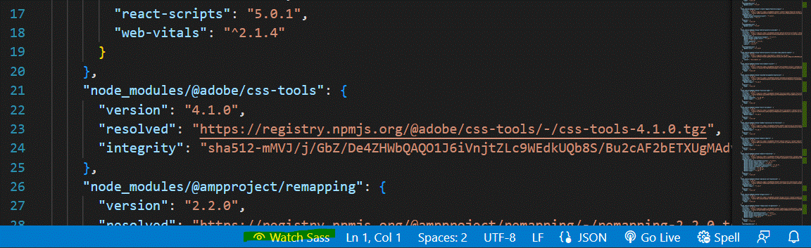

Camp_website_2024
NTNU CSIE camp website for 2024 Edit from last year's website

> # react-app-website-frontside
> 
> Testing Status. MAY NOT Download until the development complete.
> 
> # React Environment
> 
> - 請先確認電腦有安裝 node.js
> 
> - 確定版本(確認有安裝 node.js)
> 
> ```
> node --version
> ```
> 
> 指令
> 
> ```
> cd my-app
> npm i
> npm start
> ```
> 
> 之後會在預設瀏覽器開啟網頁，即完成環境架設。
> 
> - 所有要編輯的都放在 `src` 裡面，其他資料夾盡量不要動。
> 
> - 要寫的 html 會放在 `App.js` 的 `div` 標籤裡面，div container 純粹用來包住 `html` 。
> 
> # Git
> branch name: `Panda`, `NingQung`, `othsueh`, `Danny` 
> >要開始寫之前，記得 checkout 到自己的 `branch`
> ```
> git checkout name
> ```
> # 連結
> react 語法須加上 require
> ```
> 
> ```
> # 字體
> 目前特殊標題用 [Torono_Glitch_SansH2](my-app/src/style/font/torono-glitch-sans) 
> 
> 一般字體用 `font-family: "Noto Sans TC";`
> ## Problem
> # Rafc
> VScode Extension: [**rafc**](https://marketplace.visualstudio.com/items?itemName=dsznajder.es7-react-js-snippets)
> 
> 在 .js 檔中產生 react 模板
> 
> - 報名按鈕的位置
> - CSIE 的字樣對齊
> - 背景重複出現、排版
> 
> # SCSS 轉 CSS
> 
> - 先在 Vscode 下載 Extension: [Live Sass Compiler](https://marketplace.visualstudio.com/items?itemName=ritwickdey.live-sass) (直接在VS搜尋也可以)
> - 下載完後，開啟 `.scss` 的檔案，右下角會有 Watching Sass，點一下會開始編譯程式碼
> - 會在資料夾自動產生 `.css` 檔
>   成功的會有以下圖示
>    
